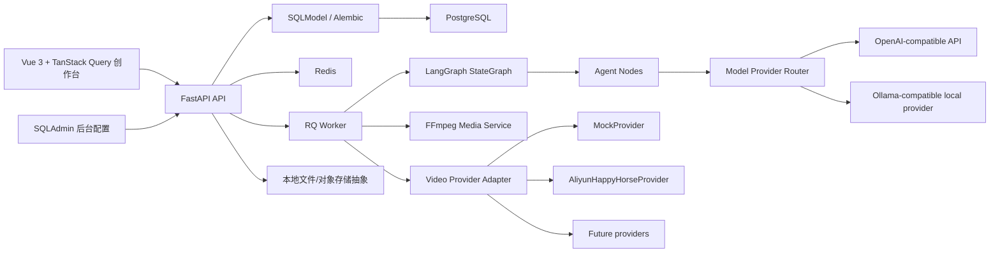

# 技术架构

日常开发优先阅读 [Project Brief](00-project-brief.md)。本文件只记录模块、接口、队列任务和存储边界；技术栈结论以 Project Brief 为准。

## 1. 总体架构



## 2. 前端页面和工具

前端主栈：

- Vue 3 + Vite。
- Pinia。
- Naive UI。
- TanStack Query for Vue。
- openapi-fetch / openapi-typescript。
- VueUse。
- lucide-vue-next。

前台创作台页面：

- 项目列表。
- 创建项目。
- 商品资料。
- 素材上传。
- 脚本页。
- 分镜/Prompt 页。
- 镜头生成方式选择。
- 审核页。
- 生成任务页。
- 成片预览页。

后台管理页面第一版优先用 SQLAdmin，减少 CRUD 页面开发：

- Agent 配置。
- 模型供应商配置。
- 视频供应商配置。
- 商品类别、卖点、适用人群、风格预设。
- 禁用词/风险规则。
- 任务日志、Agent 运行轨迹、配置导入导出。

## 3. 后端模块

```text
backend/
  app/
    main.py
    api/
    core/
    models/
    schemas/
    repositories/
    services/
      workflow/
      agents/
      providers/
      media/
      assets/
      admin/
      export/
      costing/
    workers/
    tests/
```

后端主栈：

- FastAPI。
- LangGraph。
- Pydantic schema。
- SQLModel。
- Alembic。
- SQLAdmin。
- pydantic-settings。
- httpx。
- tenacity。
- pytest。
- ruff。

## 4. LangGraph Agent Workflow

Agent 工作流用 LangGraph StateGraph 编排。节点清单、Agent 职责、Prompt Check、人工确认和失败策略以 [Agent 工作流](02-agent-workflow.md) 为准；本节只记录架构边界。

架构边界：

- Graph 模块负责任务阶段、checkpoint、interrupt/resume 和节点跳转；调用方不直接传递或管理 checkpointer。
- 业务状态必须投影到数据库，不只放在 graph state。
- `GraphState` 只保存轻量运行态和引用；长期结果由 `WorkflowRun`、`WorkflowNodeRun`、`AgentRun`、`ReviewRun`、`GenerationTask` 或业务版本记录承载。
- Agent 节点通过 `ModelProvider` 调用模型，输出经过 Pydantic 校验后保存。
- Review & Cost Gate 的 reviewer + aggregator 模式以工作流文档为准；架构层只提供服务接口和持久化边界。

工作流恢复边界：

```text
GraphState
  -> project_id
  -> workflow_run_id
  -> workflow_status
  -> current_node
  -> pending_confirmation

WorkflowRun
  -> project_id
  -> checkpoint_thread_id
  -> current_node
  -> pending_confirmation
  -> status

WorkflowNodeRun
  -> workflow_run_id
  -> node_name
  -> status
  -> agent_run_id / review_run_id / generation_task_id / output_ref
```

前端刷新页面后，后端必须以数据库中的 `WorkflowRun` 和 `WorkflowNodeRun` 为事实来源恢复页面和节点输出；LangGraph checkpoint 只负责恢复图执行状态，不能替代业务记录。

```text
ModelProvider
  -> chat()
  -> json_chat()
  -> vision_chat()
```

Provider 类型：

- OpenAI-compatible API。
- Ollama-compatible local provider。
- Mock provider。

每个 Agent 节点独立配置 provider、model、temperature、max_tokens、timeout_seconds、fallback_provider、enabled。

Review & Cost Gate：

```text
ReviewGateService
  -> run_compliance_reviewer()
  -> run_product_fidelity_reviewer()
  -> run_prompt_quality_reviewer()
  -> run_cost_reviewer()
  -> aggregate_review()
```

Gate 不直接创建真实视频任务，只输出结构化 `ReviewRun` 结果。LangGraph 在用户确认后进入任务创建节点，由应用 Service 创建 `GenerationTask`。

## 5. Video Provider Adapter

```text
VideoProvider
  -> list_capabilities()
  -> create_generation_task(spec)
  -> get_task_status(provider_task_id)
  -> download_result(provider_task_id)
  -> estimate_cost(spec)
```

`GenerationSpec`：

```text
generation_preset
duration_seconds
resolution
aspect_ratio
generation_mode
provider_key
model_key
scene_intent
product_fidelity_risk
motion_complexity
require_confirmation
```

创建任务前必须校验供应商能力、预算和确认要求。供应商返回的临时下载地址必须转存为 ProjectAsset。

## 6. 文件存储

第一版可使用本地文件目录，但业务代码必须通过 AssetService 访问文件，不直接拼路径。

后续可替换为：

- S3。
- Cloudflare R2。
- MinIO。
- 云服务器本地磁盘。

## 7. 任务队列

需要异步队列的任务：

- 商品视觉分析。
- Agent 运行。
- 视频生成轮询。
- 视频下载。
- FFmpeg 合成。
- 导出工程文件。

任务记录至少包含 status、started_at、finished_at、error_message、retry_count、provider_key、model_key、generation_mode、estimated_cost、actual_cost、elapsed_seconds、output_asset_id。
